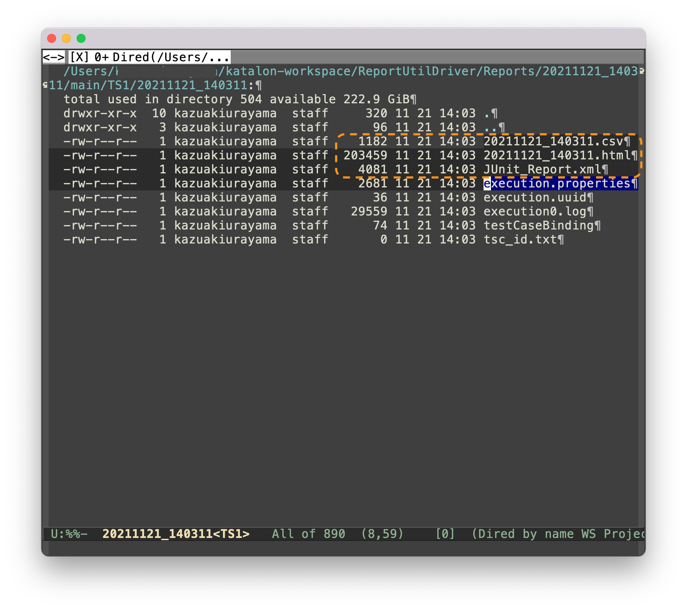
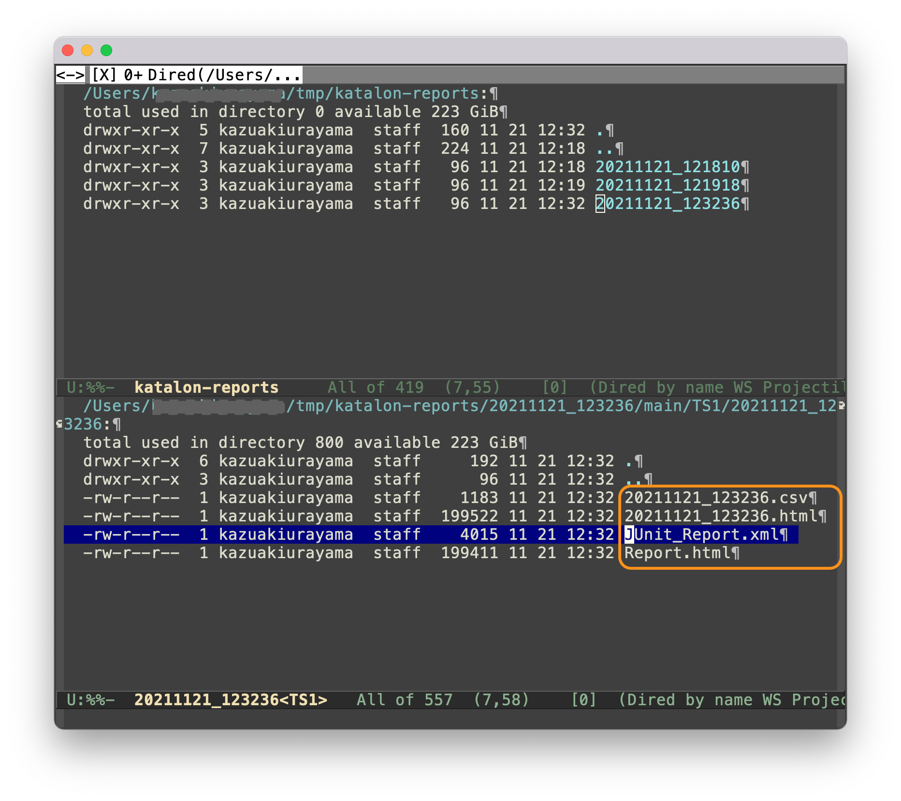

ReportUtilDriver --- how to generate test reports by user code in Katalon Studio
===

## Problem to solve

**When Katalon Studio generates a bunch of test reports (HTML, XML, CSV) ? How KS does it?**

Let me elaborate this question with a demo project.

- I created a simple Test Case [`main/TC1`](Scripts/main/TC1/Script1637150412640.groovy)
```
import static com.kms.katalon.core.testobject.ObjectRepository.findTestObject
import com.kms.katalon.core.webui.keyword.WebUiBuiltInKeywords as WebUI

WebUI.openBrowser('')
WebUI.navigateToUrl('https://katalon-demo-cura.herokuapp.com/profile.php#login')
WebUI.setText(findTestObject('Login/Page_CURA Healthcare Service_Login/input_Username_username'), 'John Doe')
WebUI.setEncryptedText(findTestObject('Login/Page_CURA Healthcare Service_Login/input_Password_password'), 'g3/DOGG74jC3Flrr3yH+3D/yKbOqqUNM')
WebUI.click(findTestObject('Login/Page_CURA Healthcare Service_Login/button_Login'))
WebUI.closeBrowser()
```
- I created a Test Suite [`main/TS1`](Test Suites/main/TS1.ts), which just executes the `TC1`.
- I created a Test Listener [`TL_listBunchDir`](Test Listeners/TL_listBunchDir.groovy):
```
import java.nio.file.Files
import java.nio.file.Path
import java.nio.file.Paths

import com.kms.katalon.core.annotation.AfterTestSuite
import com.kms.katalon.core.configuration.RunConfiguration
import com.kms.katalon.core.context.TestSuiteContext

class TL_listBunchDir {

	@AfterTestSuite
	def sampleAfterTestSuite(TestSuiteContext testSuiteContext) {
		Path projectDir = Paths.get(RunConfiguration.getProjectDir())
		Path bunchDir = Paths.get(RunConfiguration.getReportFolder())
		Files.list(bunchDir).sorted().each ({ Path p ->
			println projectDir.relativize(p).toString()
		})
	}
}
```

The `TL_listBunchDir` prints a list of files in a directory where HTML/XML reports should be written into.

When I execute the `TS1`, I got the following output in the Console.

```
2021-11-21 14:03:26.017 DEBUG testcase.TC1                             - 6: closeBrowser()
2021-11-21 14:03:26.226 INFO  c.k.katalon.core.main.TestCaseExecutor   - END Test Cases/main/TC1
Reports/20211121_140311/main/TS1/20211121_140311/execution.properties
Reports/20211121_140311/main/TS1/20211121_140311/execution0.log
Reports/20211121_140311/main/TS1/20211121_140311/execution0.log.lck
Reports/20211121_140311/main/TS1/20211121_140311/testCaseBinding
Reports/20211121_140311/main/TS1/20211121_140311/tsc_id.txt
2021-11-21 14:03:26.957 INFO  com.kms.katalon.core.util.KeywordUtil    - Start generating HTML report folder at: /Users/kazuakiurayama/katalon-workspace/ReportUtilDriver/Reports/20211121_140311/main/TS1/20211121_140311...
2021-11-21 14:03:26.995 INFO  com.kms.katalon.core.util.KeywordUtil    - HTML report generated
2021-11-21 14:03:26.997 INFO  com.kms.katalon.core.util.KeywordUtil    - Start generating CSV report folder at: /Users/kazuakiurayama/katalon-workspace/ReportUtilDriver/Reports/20211121_140311/main/TS1/20211121_140311...
2021-11-21 14:03:27.002 INFO  com.kms.katalon.core.util.KeywordUtil    - CSV report generated
2021-11-21 14:03:27.154 INFO  c.k.katalon.core.main.TestSuiteExecutor  - --------------------
2021-11-21 14:03:27.154 INFO  c.k.katalon.core.main.TestSuiteExecutor  - END Test Suites/main/TS1
2021-11-21 14:03:27.154 INFO  c.k.katalon.core.main.TestSuiteExecutor  - ====================
```

Once everything done, I looked at the reports directory and found this:



Please remark the 2 points of interest.

1. When `@AfterTestSuite`-annotated method of `TL_listBunchDir` ran, there were not the report files (HTML,XML,CSV). At that time, you can only find files `execution0.log` etc.

2. As you can see in the Console log, Katalon Studio emitted message that told KS generated reports in HTML and CSV.

Now I got the answer to my 1st question: when Katalon Studio generates a bunch of test reports (HTML, XML, CSV). When the `@AfterTestSuite`-annoated method of TestListener was invoked, the HTML report was not there yet. Katalon Studio generates it sometime after my Test Suite execution has completely finished.

But my 2nd question is still open: *How Katalon Studio generetes a HTML report?*

I have investigated the [source code](https://github.com/katalon-studio/katalon-studio-testing-framework/blob/master/Include/scripts/groovy/com/kms/katalon/core/reporting/ReportUtil.java) of Katalon Studio, and have got an answer to it.

## Answer

Katalon Studio API contains a class [`com.kms.katalon.core.reporting.ReportUtil`](https://github.com/katalon-studio/katalon-studio-testing-framework/blob/master/Include/scripts/groovy/com/kms/katalon/core/reporting/ReportUtil.java). It implements entry-point methods that transform the `execution0.log` file into the various format of reports.

Please read the source for the answer.

### Test Listener

Please read [Test Listeners/TL_generateReports](Test%20Listeners/TL_generateReports.groovy)

The @AfterTestSuite-annotated method will be invoked when a Test Suite finished running. It will call my keyword `ReportUtilDriver`.

`TL_generateReports` scans the `Reports` directory of the project, and saves the new HTML files into `/Users/myName/tmp/katalon-reports` directory.

If the `Reports` dicretory contains multiple results of Test Suite execution, say 3 sets, then `TL_genneratesReport` finds all 3 sets and re-generate reports and saves them into the output directory.

### Keyword

My keyword class `ReportUtilDriver` will call `com.kms.katalon.core.reporting.ReportUtil` to generate reports.

Please find the detail in the source code at [`com.kazurayam.ks.reporting.ReportUtilDriver`](Keywords/com/kazurayam/ks/reporting/ReportUtilDriver.groovy)

## Demo

You want to execute `Test Suites/main/TS1`.
When it finished, visit `/Users/[yourName]/tmp/katalon-reports` directory using Windows Explorer or Mac Finder. 

There you will find HTML/XML/CSV reports have been re-generated there. These files were generated by `com.kms.katalon.core.reporting.ReportUtil` which was indirectly driven my custom keyword and a TestListener.




